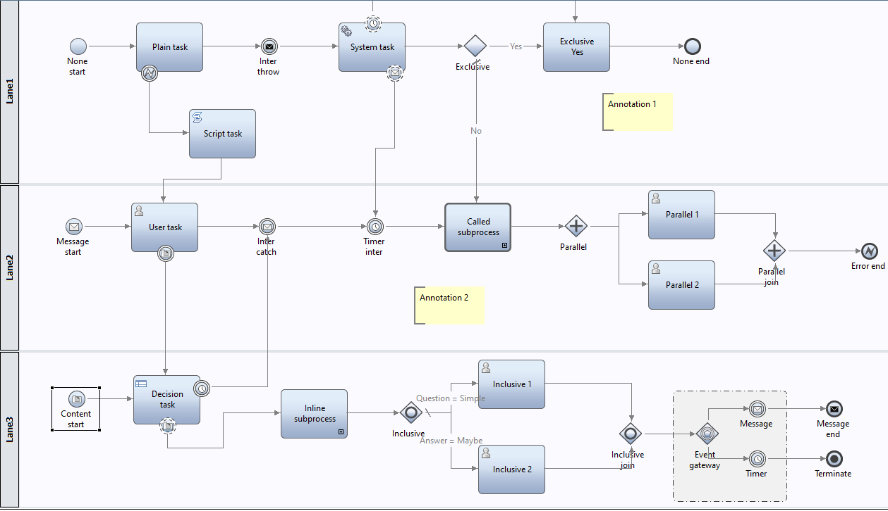
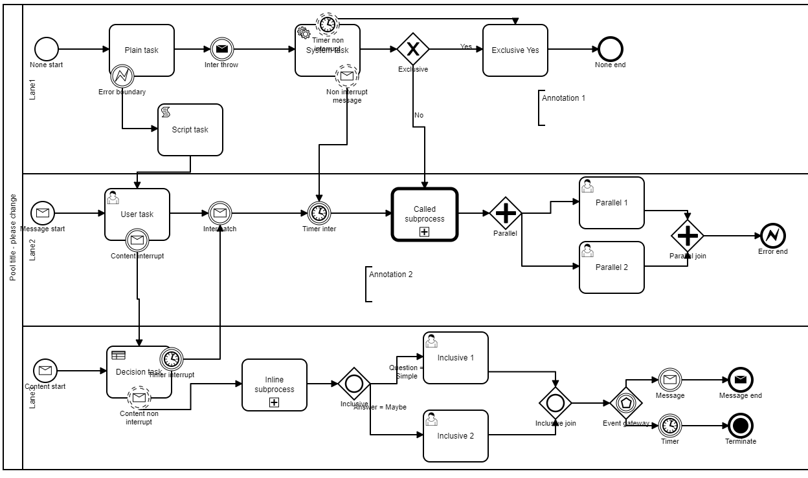

# IBM BPM .twx to BPMN Generator
The .twx export format from IBM BPM provides original diagram information which allows for a BPMN diagram that closely matches the original. The xmls that are generated in the .twx are BPMN-like but not quite BPMN. This utility reads the necessary xml and generates a BPMN file.

## How to use this utility
First, you'll need to extract the contents of the ```.twx``` file. One method is to change the file extension from ```.twx``` to ```.zip``` and extract the files. Look for the ```.xml``` files in the ```/objects``` folder of your extract. The process xmls tend to be the larger files in this folder. The xml files are human readable and you'll need to determine which one is the candidate for migration. You may want to make a copy and rename the file to something you'll remember. This will serve as the input file parameter for the tool.

Now either run the ```org.camunda.bpmn.generator.BPMNGenFromTWX```

main class in your IDE, passing in as arguments the input file and the output file or generate an executable jar file. The contents of the input file will be read and the output BPMN file will be generated. If you wish to generate an executable jar file issue the following maven command 

```mvn clean compile assembly:single``` 

and execute the following command using the resulting jar file

```java -jar BPMNModelGenerator-1.0-SNAPSHOT-jar-with-dependencies input-file output-file```

A sample process in IBM BPM:


And the corresponding BPMN conversion:


## Notes and TODOs
Maybe add things like conditions and scripts with further development.
