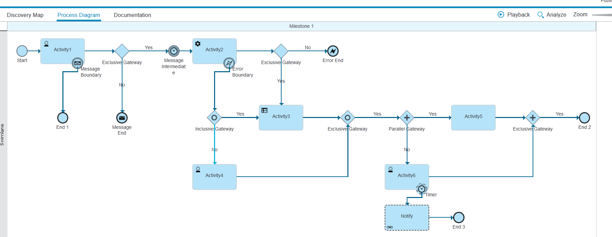

# IBM BPMN Diagram Generator
IBM does not include diagram information in BPMN file exports from IBM BPM or from IBM Blueworks Live. That information is needed to describe how to draw a process in a tool like Camunda Modeler. If an attempt is made to open a file in Camunda Modeler you'll get a 'No diagram to display' error. This utility takes the available information in the bpmn file and creates the necessary bpmndi stanza and makes the process diagram available to be opened in tools like Camunda Modeler. The algorithm draws the process in a roughly grid like  pattern. For more complex processes the resulting diagram may be difficult to read initially. If you have access to a .twx format export you can get better diagram fidelity by using the TWX migration tool.

## How to use this utility
After cloning the repository and performing the necessary maven commands, either run the ```org.camunda.create.bpmndi.BPMNDiagramGenerator```

main class in your IDE, passing in as arguments the input file and the output file or generate an executable jar file. The contents of the input file will be copied (and slightly updated) to the output file. If you wish to generate an executable jar file issue the following maven command 

```mvn clean compile assembly:single``` 

and execute the following command using the resulting jar file

```java -jar Parser-1.0-SNAPSHOT-jar-with-dependencies.jar input-file output-file```

Here is a sample process in IBM Blueworks Live


And after generating a diagram based on the BPMN export:


## Notes and TODOs
This utility has been developed using Camunda and IBM BPM exports as a template though it should work with other vendors who may not include bpmndi elements in their exports. Future updates include adding more entry and exit points on process elements for better diagram clarity. It also includes additional logic to create more waypoints (aka elbows) in sequence flows for a more natural looking initial diagram.
